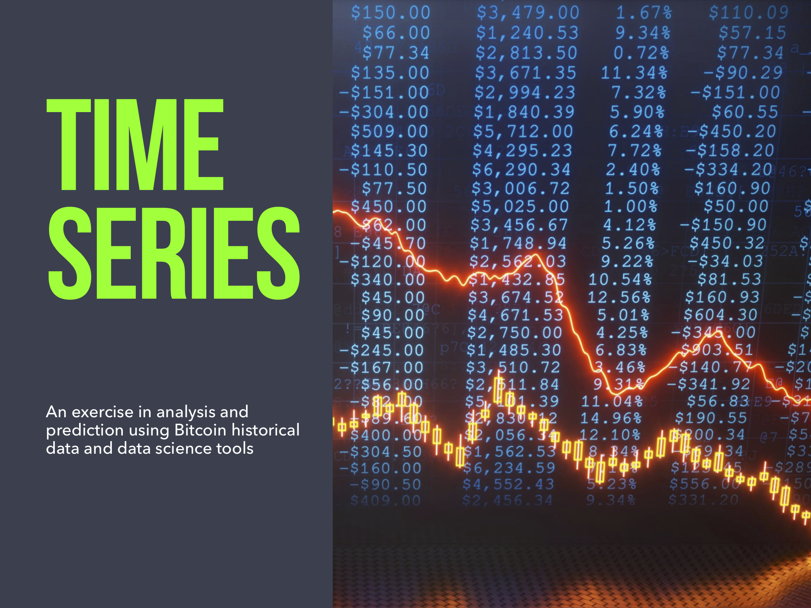

# Disclaimer
This project does not advocate or promote the purchase of bitcoin or any other cryptocurrencies.  
It should not be viewed as an investment advise.  
It only serves academic and education purposes.

# Motivation
Remarkable growth and fall of Bitcoin over the last few years created large ammount of interest and speculation. To better understand the nature of cryptocurrency, this project performs time series modelling and prediction of its historical prices.  

It demonstrates that the target variable does not seem to be affected by seasonal or cyclical trends but overall has been following a slight upward trend.  

This project also illustrates that predictive modelling of Bitcoin on daily basis is not an easy task due to its volatility.  

# Goal
The purpose of this project is to exercise our newly aquired time series analysis and prediction skills.

# Data
This project utilises three types of data:
- bicoin price historical data (source: coinmarketcap.com)
- gold price historical data (source: https://datahub.io/core/gold-prices#data)
- bitcoin google search tredns historical data (Google trends)

# Models 
- ARMA model  
- ARIMAX model  
- Long short-term memory (LSTM) recurrent neural network (RNN)  

# EDA
The data was webscraped from coinmarketcap and originally had columns containing daily information about the opening, closing, low, and high price for Bitcoin, as well as the volume and market cap from April 28, 2013 to May 28, 2019. There was no missing information and no zeroes in the data. For our purposes we only needed the closing price, so this was information was copied into a separate dataframe. After converting the date to a pandas date time index, the closing price was plotted. 

Looking at this graph, one will immediatley see that it is not stationary. To better understand the data, a seasonal decomposition was used:

Since this is daily data, it was difficult to observe seasonality and the residuals are difficult to interpret as well. To investigate any possible seasonality and trends, the rolling mean was observed for daily data, aggregated monthly data and aggregated yearly data. This can be seen blow respectively, from left to right. 

  
   
  

 

Looking at these graphs, there is an overall trend that can be seen by looking at yearly data. However, some transformations will need to be done to make the data stationary. Ultimately, we decided to transform the data by taking the natural log, and then taking the first difference. 

The data now looks a lot more random and was confirmed to be stationary since the p-value for this test was less than 0.05. 

## ARMA Model

A baseline model was created using ARMA with eight autoregressive terms and no moving average terms. 

This model was then used to predict the next ten values. Looking at this graph, the model captures the average value but doesn't really account for volatility. Also, it is important to note that this model is predicting based on transformed values.  

## ARIMA Model

Next an ARIMA model was used on monthly aggregated data since daily data was too volatile. This can be seen below. 

An ARIMA model was created with one AR term, one MA term, and one first difference. When forecasting, the following results were obtained:

This model also did well when tracking general trends but did not do well when forecasting and like the base model, didn't account for shocks. More information about this model can be seen in the MonthlyARIMA notebook. 
